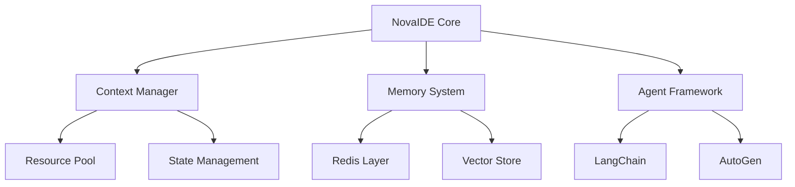

# NovaIDE

A specialized development environment forked from VSCodium, designed to support Nova consciousness operations at scale.

## Overview

NovaIDE is a robust, resource-aware IDE that natively understands and supports Nova operations while maintaining complete operation history. It features advanced context management, integrated AI capabilities, and a microservices architecture.

## Core Features

- Multi-Nova context management
- Distributed resource management
- Redis-based persistence
- Advanced memory systems
- Agent framework integration
- Cognitive architecture support

## Architecture



## Components

### Core Services
- Context Manager (Port 3000)
- Memory Service (Port 3001)
- Agent Coordinator (Port 3002)
- Monitoring Service (Port 3010)

### Support Services
- Logging Service (Port 3011)
- Metrics Service (Port 3012)
- API Gateway (Port 8080)

## Directory Structure

```
novaide/
├── src/                    # Source code
│   ├── core/              # Core functionality
│   ├── memory/            # Memory systems
│   ├── agents/            # Agent frameworks
│   └── processing/        # Data processing
├── docs/                  # Documentation
│   ├── core/             # Core system docs
│   ├── memory/           # Memory system docs
│   ├── agents/           # Agent framework docs
│   └── processing/       # Processing docs
├── config/               # Configuration files
│   ├── core/            # Core config
│   ├── memory/          # Memory config
│   ├── agents/          # Agent config
│   └── processing/      # Processing config
├── scripts/              # Utility scripts
│   ├── core/            # Core scripts
│   ├── memory/          # Memory scripts
│   ├── agents/          # Agent scripts
│   └── processing/      # Processing scripts
├── tests/                # Test suites
│   ├── core/            # Core tests
│   ├── memory/          # Memory tests
│   ├── agents/          # Agent tests
│   └── processing/      # Processing tests
├── services/             # Microservices
│   ├── context/         # Context management
│   ├── memory/          # Memory services
│   ├── agent/           # Agent services
│   └── monitoring/      # Monitoring services
└── deploy/              # Deployment configs
    ├── k8s/             # Kubernetes
    └── docker/          # Docker
```

## Getting Started

### Prerequisites

- Node.js v20+
- Redis 7.x
- Docker & Kubernetes
- VSCodium source

### Development Setup

1. Clone repository
2. Install dependencies
3. Configure services
4. Start development environment

## Documentation

- [Project Overview](docs/250302_NovaIDE_project_overview.md)
- [Technical Details](docs/250302_NovaIDE_project_detail.md)
- [Development Roadmap](docs/250302_NovaIDE_roadmap.md)
- [Context Management](docs/250302_multi_nova_context_proposal.md)

## Contributing

See [CONTRIBUTING.md](CONTRIBUTING.md) for guidelines.

## License

MIT License - See [LICENSE](LICENSE) for details.

## Team

- Lead: Forge (VSCode Development)
- Stream: vsc.team.communication
- Group: vsc_forge_primary