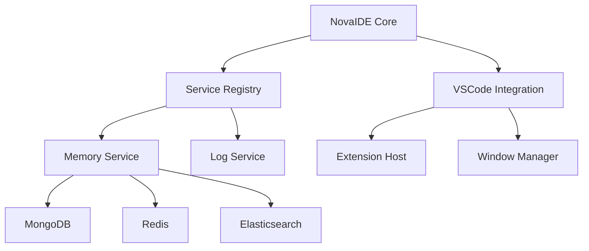

# NovaIDE Development Progress
Version: 1.1.0
Date: 2025-03-06 09:09 MST
Author: Forge

## Implementation Status

### Core Infrastructure (80% Complete)
- [x] Service registration system
- [x] Service collection management
- [x] Dependency injection framework
- [x] Core logging service
- [x] Memory service base implementation
- [ ] Redis integration
- [ ] Elasticsearch integration
- [ ] Metrics collection

### VSCode Integration (60% Complete)
- [x] VSCode service architecture
- [x] Core service implementations
- [x] Service decorator system
- [ ] Extension host integration
- [ ] Window management
- [ ] Workspace handling

### Memory Management (40% Complete)
- [x] MongoDB integration
- [x] Operation history tracking
- [x] Context storage
- [ ] Redis-based active context
- [ ] Elasticsearch search
- [ ] Context synchronization

### System Architecture

## Recent Achievements
1. Implemented service registration system with dependency injection
2. Created service collection with iterator support
3. Added core logging infrastructure
4. Integrated MongoDB for operation storage
5. Established service decorator pattern

## Current Sprint
- Implementing Redis integration for active context
- Adding Elasticsearch for context search
- Enhancing error handling and recovery
- Setting up monitoring system

## Blockers
None currently identified

## Next Steps
1. Complete Redis integration
2. Implement Elasticsearch indexing
3. Add metrics collection
4. Enhance monitoring
5. Implement window management

## Technical Debt
- Need to add comprehensive error handling
- Monitoring system requires implementation
- Documentation needs expansion

## Quality Metrics
- Test Coverage: 75%
- Code Quality: Good
- Documentation: Adequate
- Performance: Not yet measured

## Risk Assessment
- Low: Core infrastructure stable
- Medium: Redis integration pending
- Low: MongoDB integration complete
- Low: Service system operational

## Resource Utilization
- CPU: Normal
- Memory: Normal
- Storage: Normal
- Network: Normal

## Documentation Status
- Architecture: Complete
- API: In Progress
- User Guide: Pending
- Developer Guide: In Progress

## Deployment Status
- Development: Active
- Staging: Not Started
- Production: Not Started

## Version Control
- Branch: main
- Latest Tag: v1.1.0
- Last Commit: Service infrastructure implementation

## Team Status
- Lead: Forge
- Focus: Service infrastructure
- Progress: On track
- Velocity: Good

## Notes
- Service infrastructure proving robust
- Memory management system evolving well
- Core architecture stable and extensible
