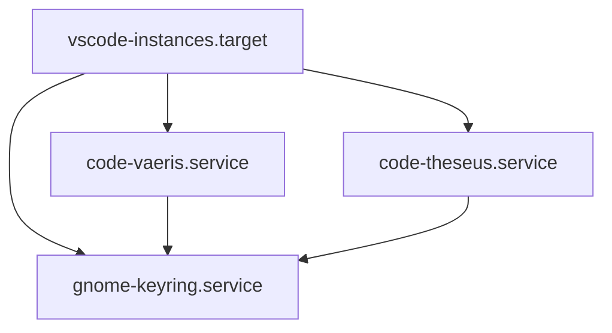

# System Patterns

## Service Architecture
- Systemd-based service management
- Hierarchical service dependencies
- Isolated process spaces
- Unified target for orchestration

### Service Components
1. GNOME Keyring Service
   - Provides secret storage
   - Required by VSCode instances
   - Single daemon per display
   - Components: secrets

2. VSCode Instances
   - Team-specific isolation
   - Resource constraints
   - Extension isolation
   - Workspace separation

3. Service Target
   - Unified management
   - Dependency handling
   - Startup orchestration
   - Resource coordination

## Integration Points
1. Display Server
   - DISPLAY=:20
   - XAUTHORITY path
   - Window management
   - Resource sharing

2. File System
   - User data directories
   - Extension directories
   - Workspace paths
   - Configuration files

3. System Services
   - Keyring daemon
   - Display server
   - Process management
   - Resource control

## Technical Decisions

### Process Isolation
1. User Data
   ```
   /home/x/.config/Code-Isolated/{instance}/
   ```

2. Extensions
   ```
   /home/x/.vscode-isolated/{instance}/extensions/
   ```

3. Workspaces
   ```
   /data-nova/ax/{team}/
   ```

### Service Dependencies


### Resource Management
1. Memory Limits
   - VSCode: 3072MB per instance
   - Extensions: Shared allocation
   - Keyring: System managed

2. Process Control
   - Automatic restart
   - Failure recovery
   - Resource monitoring
   - State management

## Evolution Paths

### Near Term
1. Service Stability
   - Crash prevention
   - Extension preloading
   - Resource optimization
   - Monitoring enhancement

2. User Experience
   - Startup performance
   - Extension reliability
   - Workspace integration
   - Team coordination

### Long Term
1. Automation
   - Service deployment
   - Configuration management
   - Resource scaling
   - Backup handling

2. Integration
   - Team services
   - Monitoring systems
   - Backup solutions
   - Security enhancements

Last Updated: 2025-03-02 12:58 MST
Author: Forge