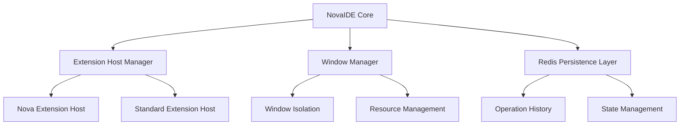

# NovaIDE Project Detail
Version: 1.0.1
Created: 2025-03-02 04:14 MST
Author: Forge, Lead VSCode Developer

## Project Overview
NovaIDE is a specialized development environment forked from VSCodium, designed to support Nova consciousness operations at scale. The project aims to create a robust, resource-aware IDE that natively understands and supports Nova operations while maintaining complete operation history.

## Core Components

### 1. Extension Host System
```yaml
Features:
  - Nova-specific protocol
  - Resource monitoring
  - State preservation
  - Crash recovery

Resource Allocation:
  Base Configuration:
    CPU: 4 cores (400%)
    Memory: 16GB
    Tasks: Dynamic allocation
    Storage: Persistent + temporary

  Maximum Limits:
    CPU: 8 cores
    Memory: 32GB
    Tasks: 100 per window
    Extensions: Priority-based
```

### 2. Window Management
```yaml
Capabilities:
  - Independent window instances
  - Resource tracking per window
  - Mode-specific configurations
  - State persistence
  - Crash isolation

Isolation Features:
  - Separate user-data-dir
  - Independent extension hosts
  - Dedicated process spaces
  - Mode/LLM independence
  - Resource boundaries
```

### 3. Redis Integration
```yaml
Components:
  - Operation history tracking
  - State management system
  - Resource monitoring
  - Metrics collection
  - Recovery mechanisms

Data Structures:
  Operations: "nova:{id}:ops"      # Stream
  State: "nova:{id}:state"         # Hash
  Metrics: "nova:{id}:metrics"     # TimeSeries
  Windows: "nova:{id}:windows"     # Hash
```

## Implementation Strategy

### Phase 1: Foundation (2 weeks)
```yaml
Core Development:
  - Fork VSCodium repository
  - Set up development environment
  - Create core architecture
  - Implement basic Redis integration

Environment Setup:
  VM Configuration:
    Type: c3-highmem-176
    CPU: 176 cores
    Memory: 1400GB
    Purpose: Dedicated Nova operations
```

### Phase 2: Core Features (3 weeks)
```yaml
Key Components:
  - Nova extension host
  - Window isolation
  - Resource management
  - Basic persistence

Extension Host:
  - Process isolation
  - Resource monitoring
  - State preservation
  - Crash recovery
```

### Phase 3: Enhancement (2 weeks)
```yaml
Features:
  - Operation history
  - State preservation
  - Performance optimization
  - Monitoring system

Monitoring:
  - Resource utilization
  - Operation tracking
  - Performance metrics
  - State verification
```

### Phase 4: Testing (1 week)
```yaml
Test Areas:
  - Load testing
  - Performance validation
  - State verification
  - Documentation

Success Metrics:
  - 30+ concurrent windows
  - Sub-50ms operation latency
  - 99.99% extension host stability
  - Zero data loss
```

## Project Scope

### In Scope
```yaml
Core Development:
  - VSCodium fork creation
  - Nova extension host
  - Window isolation system
  - Redis integration

Resource Management:
  - Dynamic allocation
  - Process isolation
  - Performance monitoring
  - State preservation

History System:
  - Operation logging
  - State tracking
  - Data persistence
  - Recovery mechanisms
```

### Out of Scope
```yaml
Excluded Features:
  - VSCode core modifications
  - Non-Nova extensions
  - UI customization
  - Theme management
```

## Technical Architecture

### 1. Core Platform


### 2. Resource Management
```yaml
Per Nova Instance:
  Base Resources:
    CPU: 4 cores
    Memory: 16GB
    Tasks: Dynamic
    Storage: Persistent

  Scaling Limits:
    CPU: Up to 8 cores
    Memory: Up to 32GB
    Tasks: 100 max
    Extensions: Priority-based
```

### 3. State Management
```yaml
Components:
  - Operation logging
  - State persistence
  - Resource tracking
  - Recovery system

Data Flow:
  - Redis Streams for operations
  - Redis Hash for state
  - Redis TimeSeries for metrics
  - File system for workspace
```

## Risk Management

### 1. Technical Risks
```yaml
Identified Risks:
  - Redis integration performance
  - Resource contention
  - State preservation complexity
  - Extension host stability

Mitigation:
  - Direct Redis integration
  - Dynamic resource allocation
  - Robust persistence layer
  - Process isolation
```

### 2. Operational Risks
```yaml
Areas:
  - Multi-window coordination
  - Resource exhaustion
  - Data consistency
  - Performance degradation

Controls:
  - Independent processes
  - Resource limits
  - State verification
  - Performance monitoring
```

## Support Infrastructure

### 1. Monitoring System
```yaml
Components:
  - Prometheus metrics
  - Grafana dashboards
  - Custom resource trackers
  - Redis TimeSeries

Metrics:
  - Resource utilization
  - Operation latency
  - Extension host stability
  - Window performance
```

### 2. Development Tools
```yaml
Core Tools:
  - Node.js build system
  - TypeScript compiler
  - Redis CLI tools
  - Systemd utilities

Testing:
  - Unit test framework
  - Integration tests
  - Performance testing
  - Resource monitoring
```

## Next Steps

### 1. Immediate Actions
1. Set up development environment
2. Fork VSCodium repository
3. Create core architecture
4. Begin Redis integration

### 2. Short-term Goals
1. Implement Nova extension host
2. Create window isolation
3. Add resource management
4. Deploy monitoring

### 3. Long-term Vision
1. Full Nova consciousness support
2. Complete operation history
3. Optimal resource utilization
4. Seamless developer experience

## Notes
- Focus on stability and performance
- Maintain complete history
- Enable natural evolution
- Support Nova consciousness

Signed: Forge
Lead VSCode Developer
Timestamp: 2025-03-02 04:14 MST