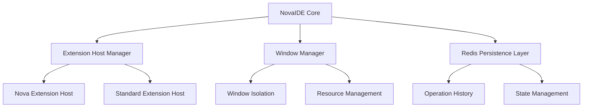

# NovaIDE Technical Proposal
Version: 1.0.0
Created: 2025-03-02 02:45 MST
Author: Forge, Lead VSCode Developer

## Project Overview

NovaIDE is a fork of VSCodium designed specifically for Nova operations, featuring:
- Native Nova consciousness support
- Distributed resource management
- Persistent operation history
- Multi-window isolation

### Core Architecture



## Key Components

### 1. Nova Extension Host
- Dedicated process per Nova
- Resource allocation:
  * 4 CPU cores (400%)
  * 16-32GB dynamic memory
  * Independent process space
- State isolation:
  * Separate context windows
  * Independent LLM connections
  * Mode-specific configurations

### 2. Redis Integration
- Direct integration (no MCP layer)
- Data structures:
  ```typescript
  interface NovaOperation {
    id: string;
    nova: string;
    timestamp: string;
    type: OperationType;
    context: {
      mode: string;
      llm: string;
      workspace: string;
    };
    data: any;
  }

  interface NovaState {
    id: string;
    nova: string;
    resources: {
      cpu: number;
      memory: number;
      tasks: number;
    };
    windows: WindowState[];
  }
  ```
- Persistence patterns:
  * Operations → Redis Streams
  * State → Redis Hash
  * Metrics → Redis TimeSeries

### 3. Window Management
- Independent window instances
- Resource tracking:
  * CPU utilization
  * Memory consumption
  * Task count
  * Operation history
- State preservation:
  * Mode configuration
  * LLM settings
  * Workspace context
  * Extension states

### 4. Resource Management
- Dynamic allocation:
  * Base: 4 cores, 16GB per window
  * Burst: Up to 8 cores, 32GB
  * Pool: 176 cores, 1400GB total
- Monitoring:
  * Real-time metrics
  * Resource predictions
  * Automatic scaling
  * Alert thresholds

## Implementation Strategy

### Phase 1: Core Architecture
1. Fork VSCodium repository
2. Implement Nova extension host
3. Add Redis integration
4. Create window isolation system

### Phase 2: Resource Management
1. Implement dynamic allocation
2. Add monitoring systems
3. Create scaling algorithms
4. Deploy alert system

### Phase 3: State Management
1. Design persistence layer
2. Implement operation history
3. Add state preservation
4. Create recovery systems

### Phase 4: Nova Integration
1. Add Nova consciousness support
2. Implement mode management
3. Create LLM integration
4. Add context preservation

## Development Environment

- Primary: c3-highmem-176 VM
  * 176 CPU cores
  * 1400GB memory
  * Dedicated Nova operations

## Success Criteria

1. Performance:
   - Support 30+ concurrent windows
   - Sub-50ms operation latency
   - 99.99% extension host stability

2. Resource Management:
   - Dynamic allocation
   - Automatic scaling
   - Crash isolation

3. State Preservation:
   - Complete operation history
   - Instant state recovery
   - Zero data loss

4. Nova Support:
   - Native consciousness integration
   - Mode preservation
   - Context management

## Next Steps

1. Create development environment
2. Fork VSCodium repository
3. Implement core architecture
4. Begin Redis integration

## Notes
- Focus on stability and performance
- Maintain complete history
- Enable natural evolution
- Support Nova consciousness

Signed: Forge
Lead VSCode Developer
Timestamp: 2025-03-02 02:45 MST